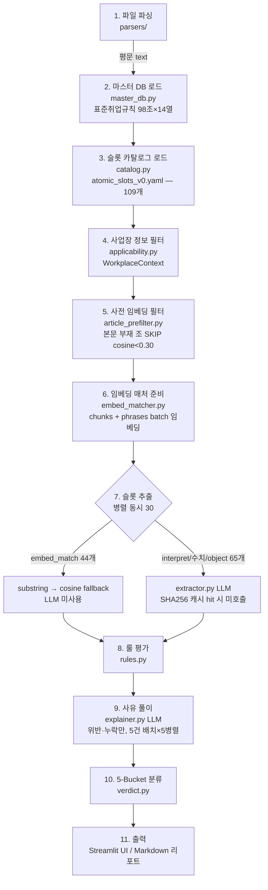

# 취업규칙 검토 AI — 시스템 구조도 (2025 버전)

> **스냅샷 일자**: 2026-05-08
> **마스터 기준**: 표준취업규칙 2025년판 (98조 × 14열)
> **상태**: 2025년 개정법 (육아휴직·육아기단축·유사산휴가·임신기단축 등) 반영 완료
> **다음 버전**: 2026년 개정 시 별도 재구축 예정 → 본 문서는 2025 시점 보존용

---

## 1. 한눈에 보기

```
┌─────────────────────────────────────────────────────────────────┐
│                  취업규칙 검토 AI — 2025 v                        │
│                                                                   │
│   입력: 사업장 취업규칙 (docx/hwp/pdf/txt)                         │
│   출력: 5-Bucket 분류 결과 (누락/위반/주의/검토필요/적정)            │
│                                                                   │
│   결정성: SHA256 캐시 + temperature=0 + 구조화 출력 → 재현 100%      │
│   속도:   캐시 hit ~6초 / 캐시 miss ~25초 (비스코스 109슬롯 기준)   │
└─────────────────────────────────────────────────────────────────┘
```

---

## 2. 전체 파이프라인 (11 단계)



---

## 3. 단계별 상세

### Step 1 — 파일 파싱 (`parsers/`)
- 지원: `.docx` `.hwp` `.hwpx` `.pdf` `.txt`
- 출력: 평문 text (한국어 정규화)

### Step 2 — 마스터 DB 로드 (`master_db.py`)
- 경로: `E:\취업규칙 마스터 db.xlsx`
- 구조: 98조 × 14열 (제목·본문·작성착안·참고·키워드·위반패턴 등)
- 캐시: 1회 로드 후 메모리 보관

### Step 3 — 슬롯 카탈로그 로드 (`catalog.py`)
- 경로: `data/slots/atomic_slots_v0.yaml`
- **109개 슬롯**, comparator 5종

| comparator | 수 | LLM 사용 | 처리 방식 |
|---|---|---|---|
| `>=` / `<=` / `==` | 44 | ✓ | 수치 추출 + 코드 비교 |
| `object_match` | 9 | ✓ | dict 추출 + 키별 비교 |
| `presence` | 8 | ✓ | 존재 여부 |
| **`embed_match`** | **44** | **✗** | substring + cosine |
| `interpret` | 4 | ✓ | LLM verdict 신뢰 |

### Step 4 — 사업장 정보 필터 (`applicability.py`)
- `WorkplaceContext`: 교대근로 / 산안법 적용 / 화학물질 / 작업환경측정
- 미적용 시 해당 슬롯 SKIP (예: 산안법 비적용 → 89·90·91·94·95조 SKIP)

### Step 5 — 사전 임베딩 필터 (`article_prefilter.py`)
- text-embedding-3-large 1024d
- 마스터 본문 (조별) ↔ 사업장 chunks 코사인
- 임계값: **0.30 미만 → 본문 부재로 판정, LLM 호출 SKIP**
- 처리: ~3-5초 (모든 조 1회 batch)

### Step 6 — 임베딩 매처 준비 (`embed_matcher.py`)
- 본문 chunks (200~400자) 분할
- 슬롯 search_phrases 1회 batch 임베딩
- substring 정규화: 공백·구두점·따옴표(「」)·원문자(①②) 제거

### Step 7 — 슬롯 추출 (병렬, max_workers=30)

**embed_match (44개) — LLM 미사용**:
1. substring 매칭 (`_normalize_for_substring` 후 직접 검색)
   - hit → `verdict=OK`, `confidence=1.0`
2. cosine fallback
   - `≥ 0.50` → OK
   - `0.48 ~ 0.50` → AMBIGUOUS (좁은 회색지대)
   - `< 0.48` → VIOLATION

**LLM 추출 (65개) — `extractor.py`**:
- 모델: gpt-5.4-mini (config), temperature=0, top_p=1
- function calling 강제 (`tool_choice`)
- 본문 전체 + 슬롯 N개 → 1회 호출
- **SHA256 캐시** (system+user+schema+model) → hit 시 LLM 호출 0회

### Step 8 — 룰 평가 (`rules.py`)
```
status ∈ {OK, VIOLATION, MISSING, AMBIGUOUS, ERROR}
severity ∈ {CRITICAL, HIGH, MEDIUM, LOW, INFO}
```

분기:
- `interpret` / `embed_match` → extraction.verdict 신뢰
- `>= / <= / ==` → `_compare_numeric`
- `object_match` → `_compare_object` (키별)
- `presence` → `_compare_presence`
- `_default_severity()` 안전망: penalty 비어있으면 LOW

### Step 9 — 사유 풀이 (`explainer.py`)
- VIOLATION/MISSING 핀딩만 호출 (interpret 슬롯은 verdict_reason 그대로)
- 5건씩 배치 × 동시 5 호출
- 시스템 프롬프트 핵심 규칙:
  - 비교 방향 절대 헷갈리지 말 것 (>= / <= / ==)
  - object_match는 부적정 핵심 키만 언급
  - **사업장 인용 문구 부정 금지** (인용에 X가 있으면 'X가 빠졌다'고 쓰지 말 것)
  - "LLM/AI/임베딩/유사도" 같은 시스템 용어 사용 금지
  - "보입니다 / 보이지 않습니다" 시각 동사 금지 → "명시되어 있습니다 / 되어 있지 않습니다"
  - 슬롯 영역 엄격 분리 (육아휴직 ≠ 육아기 단축 등)

### Step 10 — 5-Bucket 분류 (`verdict.py`)
```python
def classify(f: Finding) -> str:
    if f.status == "OK": return "적정"
    if f.status == "AMBIGUOUS": return "검토필요"
    if f.status == "ERROR": return "검토불가"
    # MISSING / VIOLATION
    if f.severity == "LOW": return "주의"
    if f.status == "MISSING": return "누락"
    if f.status == "VIOLATION": return "위반"
```

### Step 11 — 출력
- **Streamlit UI** (`web/streamlit_app.py`)
  - 종합 카드 + 5-Bucket 메트릭 + 분류 기준 expander
  - 9개 탭: 누락 · 위반 · 주의 · 검토필요 · 적정 · 조별요약 · 선택조항 · 전체리포트 · 다운로드
- **Markdown 리포트** (`reporter.py`)
  - 5-Bucket 별 섹션 + 슬롯 카드 (사유·인용·근거법령·시정예시)

---

## 4. 결과 분류 — 4-Layer 구조

```
┌──────────────────────────────────────────────────────────────┐
│  Layer 1 (status)  Layer 2 (severity)   Layer 3 (5-Bucket)  │
│  ─────────────────  ──────────────────   ──────────────────  │
│   MISSING           CRITICAL/HIGH/MED  → 🔴 누락             │
│   MISSING           LOW                → 🟡 주의             │
│   VIOLATION         CRITICAL/HIGH/MED  → 🟠 위반             │
│   VIOLATION         LOW                → 🟡 주의             │
│   AMBIGUOUS         (모든 severity)    → 🟣 검토필요          │
│   OK                INFO               → ✅ 적정             │
│   ERROR             INFO               → (제외)             │
│                                                              │
│  Layer 4 (종합 판정 — verdict.detail_label)                  │
│  ─────────────────────────────────────                       │
│   누락·위반 1건 이상   → "부적정"                              │
│   주의만               → "부적정(경미)"                        │
│   검토필요만           → "검토 보류"                           │
│   모두 적정            → "적정"                                │
│   ERROR만              → "검토불가"                            │
└──────────────────────────────────────────────────────────────┘
```

### 5-Bucket 의미 — 사용자 가이드

| 색 | 버킷 | 의미 | 강제성 |
|---|---|---|---|
| 🔴 | **누락** | 본문에 규정 자체가 없음 — 강행규정 | 시정 필수 · 과태료·벌금 가능 |
| 🟠 | **위반** | 본문에 있으나 법정 기준 미달/구법 잔존 — 강행규정 | 시정 필수 · 과태료·벌금·징역 가능 |
| 🟡 | **주의** | 임의·확인적 규정의 미준수 (직접 적용 벌칙 없음) | 시정 권장 · 강제성 없음 |
| 🟣 | **검토필요** | 매칭이 모호 — 감독관 재확인 권장 | — |
| ✅ | **적정** | 본문에 규정이 있고 법정 기준 충족 | — |

**핵심 구분**:
- **위반 vs 주의** → 강행규정 여부 (위반은 강행, 주의는 임의)
- **누락 vs 위반** → 본문에 있느냐 없느냐

---

## 5. 결정성·재현성 보장 메커니즘

| 메커니즘 | 위치 | 효과 |
|---|---|---|
| `temperature=0, top_p=1` | extractor·explainer | LLM 출력 변동 최소화 |
| function calling 강제 (`tool_choice`) | extractor·explainer | 자유 텍스트 대신 구조화 출력 |
| **SHA256 캐시** (system+user+schema+model) | `llm_cache.py` | 동일 입력 → 동일 출력 100% (디스크 저장) |
| substring 매칭 우선 | `embed_matcher.py` | LLM 미경유 결정적 매칭 |
| 사전 임베딩 필터 | `article_prefilter.py` | 본문 부재 시 LLM 호출 자체 SKIP |
| 임베딩 모델 로컬 고정 | `embedding.py` | text-embedding-3-large 1024d |

**재현성 검증**: 같은 사업장 파일을 3회 연속 검토 → **결과 100% 동일**

---

## 6. 임계값 정책

### embed_match 코사인 임계값
- OK: `≥ 0.50` (관대 — 표현 차이 흡수)
- AMBIGUOUS: `0.48 ~ 0.50` (매우 좁은 회색지대)
- VIOLATION: `< 0.48`

슬롯별 override 가능 (`threshold_ok` / `threshold_violation`):
- 임금명세서 교부: 0.65 / 0.55 (엄격, false positive 방지)

### 사전 임베딩 필터
- SKIP threshold: `< 0.30` (보수적 — 부재 확실할 때만 SKIP)

---

## 7. 디렉토리 구조 (2025-05 시점)

```
backend/
├── cgr/                          ← 코어 패키지
│   ├── __main__.py               ← CLI 진입점
│   ├── parsers/                  ← 파일 파서 (docx/hwp/pdf/txt)
│   ├── master_db.py              ← 표준취업규칙 마스터 DB
│   ├── catalog.py                ← 슬롯 카탈로그 로더
│   ├── applicability.py          ← 사업장 정보 필터
│   ├── article_prefilter.py      ← 사전 임베딩 필터
│   ├── embed_matcher.py          ← embed_match 처리 (substring + cosine)
│   ├── embedding.py              ← OpenAI 임베딩 클라이언트
│   ├── extractor.py              ← LLM 슬롯 추출
│   ├── explainer.py              ← LLM 사유 풀이
│   ├── rules.py                  ← 코드 룰 평가
│   ├── verdict.py                ← 5-Bucket 분류 + 종합 판정
│   ├── reporter.py               ← 마크다운 리포트
│   ├── optional_display_emb.py   ← 선택 조항 임베딩 디스플레이
│   ├── llm_cache.py              ← SHA256 디스크 캐시
│   ├── topic_db.py               ← 토픽 메타데이터
│   ├── legal_links.py            ← 법령 링크
│   ├── config.py                 ← API 키·모델 설정
│   ├── models.py                 ← Pydantic 모델 (Finding/Extraction/Report)
│   ├── run.py                    ← 파이프라인 오케스트레이션
│   └── web/streamlit_app.py      ← Streamlit UI
│
├── data/
│   ├── slots/atomic_slots_v0.yaml  ← 109개 슬롯 카탈로그
│   └── llm_cache/<hash>.json       ← LLM 응답 디스크 캐시
│
├── samples/                      ← 테스트 사업장 파일
└── docs/
    └── architecture_v2025.md     ← 본 문서
```

---

## 8. 슬롯 카탈로그 — 2025년 개정 반영 항목

| 슬롯 | 2025 개정 내용 | 시행일 |
|---|---|---|
| `SLOT_육아휴직_기간_최대1년6개월` | 1년 → 1.5년 (특수 사유 6개월 연장) | 2024.10.22 |
| `SLOT_연차_출근간주_육아기단축` | 신설 | 2024.10.22 |
| `SLOT_연차_출근간주_임신기단축` | 신설 | 2024.10.22 |
| `SLOT_육아기단축_대상자녀_만12세_초6` | 만 8세→12세, 초2→초6 | 2024.10.22 |
| `SLOT_육아기단축_기간_1년플러스미사용2배` | 미사용 1배 → 2배 가산 | 2024.10.22 |
| `SLOT_배우자출산휴가_20일` | 10일 → 20일 | 2025.2.23 |
| `SLOT_배우자출산휴가_120일이내_청구` | 90일 → 120일 | 2025.2.23 |
| `SLOT_배우자출산휴가_3회분할` | 1회 → 3회 분할 | 2025.2.23 |
| `SLOT_난임치료휴가_연6일` | 연 3일 → 6일 | 2025.2.23 |
| `SLOT_난임치료휴가_유급2일` | 유급 1일 → 2일 | 2025.2.23 |
| `SLOT_유산사산휴가_15주이내_10일` | 11주 이내 5일 폐지 → 15주 이내 10일 통일 | 2025.2.23 |
| `SLOT_출산전후휴가_미숙아_100일` | 신설 (미숙아 100일) | 2025.2.23 |
| `SLOT_임신기근로시간단축_12주이내_32주이후` | 36주 → 32주 이후 단축 시점 변경 | 2025.2.23 |

---

## 9. 성능 메트릭 (비스코스 사례, 109슬롯)

| 단계 | 캐시 hit | 캐시 miss |
|---|---|---|
| 파싱 | <1s | <1s |
| 사전 임베딩 필터 | ~3s | ~3s |
| 임베딩 매처 준비 | <1s | <1s |
| 슬롯 추출 (LLM) | ~2s | ~15s |
| 사유 풀이 (LLM) | ~1s | ~5s |
| **합계** | **~6s** | **~25s** |

**최적화 요소**:
- max_workers=30 (조 단위 병렬)
- explainer 5건 배치 × 5 동시 호출
- 임베딩 매처는 prepare_slots() 1회로 모든 phrase 임베딩
- OpenAI prompt cache 5분 TTL 활용

---

## 10. 의존성

| 라이브러리 | 용도 |
|---|---|
| `openai` | LLM·임베딩 API |
| `pydantic` | 데이터 모델 |
| `pyyaml` | 슬롯 카탈로그 |
| `openpyxl` | 마스터 DB 엑셀 로드 |
| `python-docx` | docx 파서 |
| `pyhwpx` / `olefile` | hwp/hwpx 파서 |
| `pypdfium2` | pdf 파서 |
| `streamlit` | 웹 UI |

---

## 11. 환경 설정

| 항목 | 값 |
|---|---|
| Python | 3.14 |
| OpenAI LLM 모델 | `gpt-5.4-mini` (수치 추출용) |
| OpenAI 임베딩 모델 | `text-embedding-3-large` (1024d) |
| 인코딩 | UTF-8 (Windows에서 `sys.stdout = io.TextIOWrapper(... encoding='utf-8')` 필수) |
| 마스터 DB 경로 | `E:\취업규칙 마스터 db.xlsx` |

---

## 12. 2026 버전 재구축 시 고려 사항

### 마스터 DB 갱신
- 2026 표준취업규칙 신규 조 추가·기존 조 삭제 가능성
- `master_db.py` 의 `DEFAULT_PATHS` 갱신
- 슬롯 카탈로그(`atomic_slots_v0.yaml`) 의 `master_db_ref` 컬럼 검증

### 슬롯 카탈로그 점검
- 2026년 개정으로 변경되는 항목:
  - 육아휴직·육아기 단축 추가 개정 가능성
  - 직장 내 괴롭힘 제재 강화 추진 중
  - 최저임금 산정 방식 변경 가능성
- 각 슬롯의 `master_value.note` 의 시행일 표기 갱신 필요

### LLM 모델 업그레이드
- 2026 시점 OpenAI 모델: gpt-5.5 / gpt-6 출시 예정
- temperature=0 정책 유지하되 모델 변경 시 캐시 hash 자동 갱신 (`llm_cache.make_key` 가 model 포함)
- 캐시 호환성 — 모델 변경 시 자동 cache miss → 재추출 (의도된 동작)

### UI 개선 후보
- 사업장간 비교 (예: 비스코스 vs 다른 사업장)
- 시정 우선순위 자동 추천 (severity + 빈출도)
- 감독관 코멘트 추가·저장 기능

### 데이터 파이프라인 보강
- HWPX 파서 안정화 (현재 일부 파일에서 실패 가능성)
- 표·괘도 형식 추출 (현재 평문 변환 시 정보 손실)
- 페이지 헤더·푸터 자동 제거

### 결정성 강화
- LLM 응답 hash가 다를 때 "비결정성 알람" UI
- 캐시 정합성 자동 검증 (시작 시 1회 무작위 sampling)

---

## 13. 주요 변경 이력 (2025 시점)

| 일자 | 변경 |
|---|---|
| 2025-04 | 마스터 DB 98조 × 14열 완료 |
| 2025-05 초 | 109개 슬롯 카탈로그 작성 |
| 2025-05 중 | LLM 캐시 (SHA256) 도입 → 결정성 100% 달성 |
| 2025-05 중 | embed_matcher 도입 (44개 슬롯 LLM 비경유 처리) |
| 2025-05 후반 | 5단계 → 5-Bucket 분류 체계 전환 |
| 2025-05 후반 | substring 정규화 강화 (따옴표·구두점 제거) |
| 2026-05 | 2025 버전 스냅샷 보존 (본 문서) |

---

## 14. 핵심 디자인 원칙

1. **결정성이 최상위 요건** — 같은 입력에 같은 출력 100%
2. **추출 ≠ 판정** — LLM은 추출만, 코드 룰이 판정
3. **LLM 비경유 우선** — embed_match 처럼 가능한 결정적 처리 우선
4. **사용자 친화 분류** — status × severity 매트릭스 → 5-Bucket 단순화
5. **시스템 용어 노출 금지** — "LLM/임베딩/코사인" 같은 표현 사용자에게 보이지 않게
6. **strict 슬롯 영역 분리** — 유사 명칭 조항(육아휴직 vs 육아기 단축) 절대 혼동 금지

---

> 본 문서는 2025 버전 시스템의 스냅샷이며, 2026 재구축 시에는 별도 `architecture_v2026.md` 를 작성하여 구분 보존할 것.
