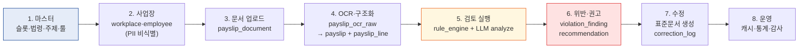
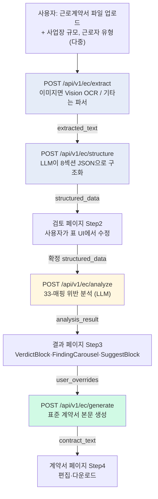
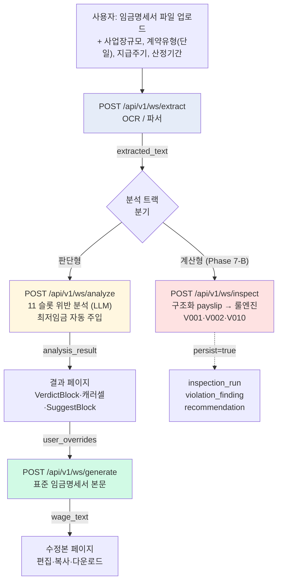
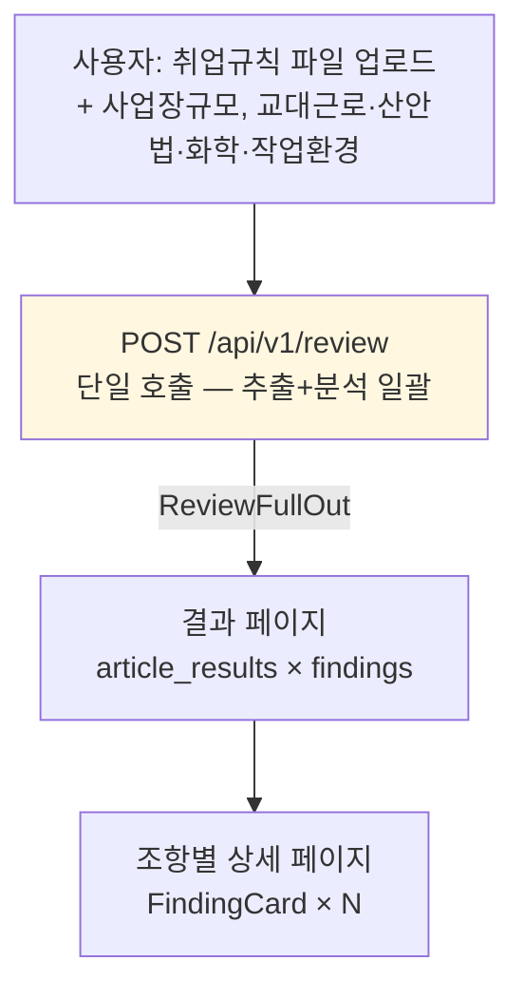
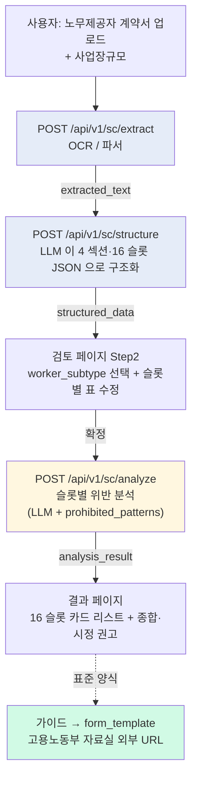
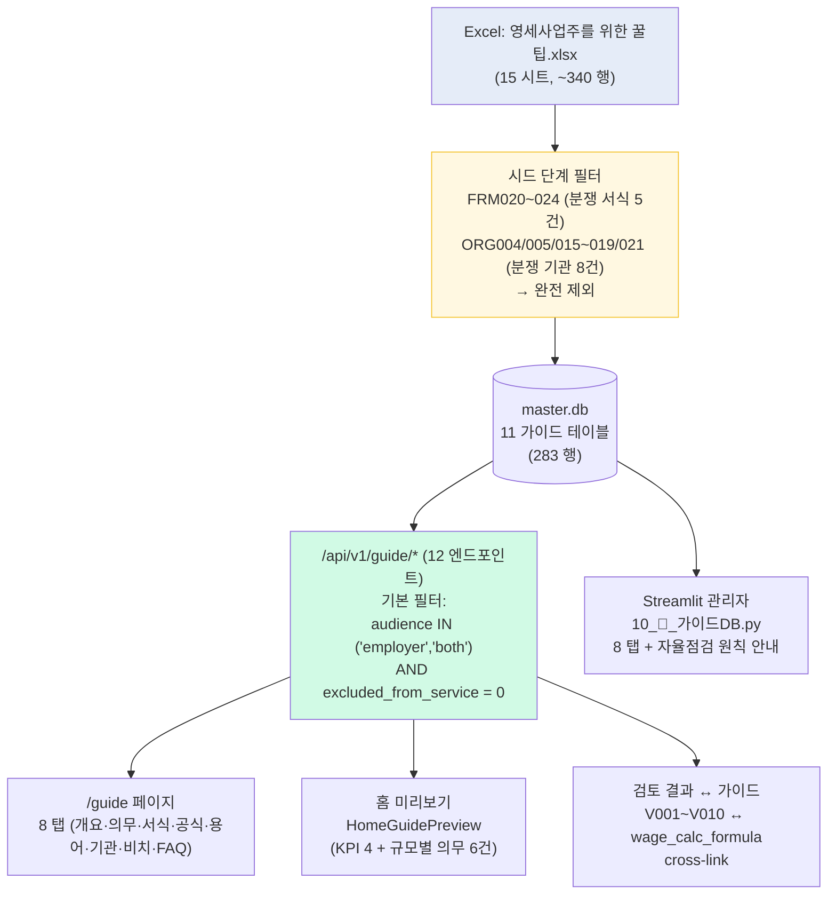
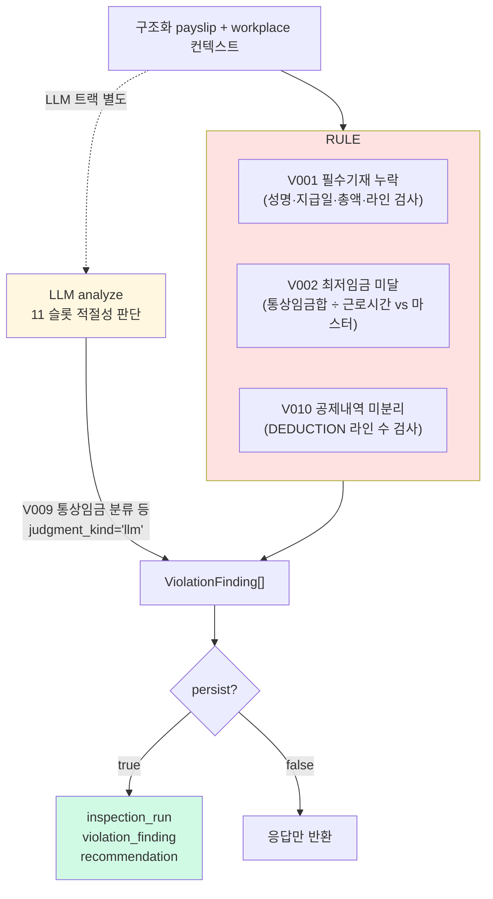
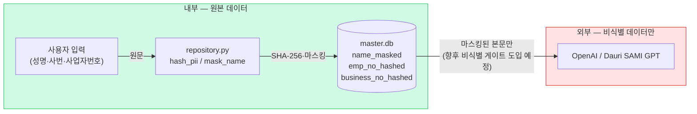
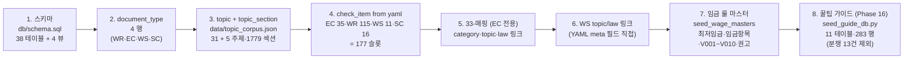
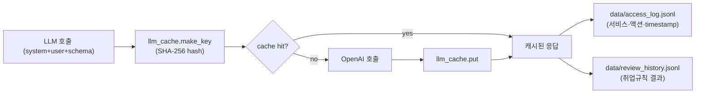

# 02 · 데이터 파이프라인

3 문서 (취업규칙·근로계약서·임금명세서) 각각의 입력→처리→출력 흐름.
공통 단계와 문서별 분기를 명확히.

---

## 1. 전체 파이프라인 (8 단계)



---

## 2. 문서별 파이프라인

### 2-1. 근로계약서 (Employment Contract)



**EC 의 특징**
- 4 단계 명시 (extract → structure → analyze → generate)
- Step2 검토 페이지에서 사용자가 표를 수정 가능
- 33-매핑 (공통/5인이상/기간제/단시간/일용직/연소자/외국인) 분기
- 챗봇 (`/ec/chat`) 으로 결과 후속 질문

### 2-2. 임금명세서 (Wage Statement)



**WS 의 특징**
- 11 슬롯 (단일 그룹 — 33-매핑 없음)
- LLM 분석 (`/analyze`) + 계산형 룰엔진 (`/inspect`) 이원 트랙
- 산정 대상 연도 → 마스터 DB 에서 해당 연도 최저임금 자동 주입
- 계약 유형 단일 선택 (정규/기간제/단시간/일용)

### 2-3. 취업규칙 (Work Rules)



**WR 의 특징**
- 단일 호출 — extract+analyze 한 번에
- 98 조 (`article`) × N findings 구조
- 슬롯 카탈로그 — `atomic_slots_v0.yaml` (115 슬롯)

### 2-4. 노무제공자 계약서 (Service Provider Contract) — Phase 17

특수형태근로종사자(특고)·플랫폼 종사자 등 도급·위임 관계 검토. EC 와 유사한 3 단계, generate 단계 없음.



**SC 의 특징**
- 16 슬롯 카탈로그 — `atomic_slots_sc.yaml` (Phase 17 신설)
- worker_subtype (`산재적용_특고16` / `고용보험_노무제공자19` / `플랫폼종사자` / `기타_도급`) 컨텍스트가 사회보험 슬롯 평가에 결정적
- "근로자성 위장 방지" — 종속성 강화 표현(`출근 시간 준수`, `취업규칙 준수` 등) 을 `prohibited_patterns` 로 검출
- generate 단계 없음 — 표준 양식은 고용노동부 자료실 외부 URL 로 안내(가이드 `form_template`)
- 신규 법령 6개 등록: 산재보험법, 고용보험법, 산업안전보건법, 민법 일부

### 2-5. 꿀팁 가이드 (Reference, 정적 조회) — Phase 16

문서 업로드·OCR·LLM 없음. **정적 reference DB → 사업주 자율점검 보조**.



**가이드 도메인의 특징**
- **자율점검 원칙** — 진정·구제·노동위원회 등 분쟁 경로 데이터 13건 시드 단계 사전 제외
- 방어 필터 이중화 — `excluded_from_service` 컬럼 + API 기본 audience 필터
- `wage_calc_formula.related_violation_code` FK — 룰엔진 V001~V010 위반 결과에서 가이드 공식으로 직링크
- `size_threshold_duty` 의 SIZE_RANK 누적 — 5인 이상 사업장은 1인+ 의무까지 모두 노출
- `form_template.download_url` 은 고용노동부 자료실 외부 URL (호스팅 안 함 / Phase 18 에서 채움)

---

## 3. 룰엔진 + LLM 하이브리드 (임금명세서)



**계산 결정성** — 같은 PayslipIn → 같은 ViolationFinding 리스트.
`ruleset_version` 컬럼에 박혀 시점 재현 가능.

---

## 4. PII 비식별화 경계



**현재 상태**: 사업장·근로자 ID 컬럼은 해시·마스킹 저장.
임금명세서 OCR 본문은 그대로 LLM 호출. 후속 Phase 에서 본문 자체도 비식별 게이트 도입 예정.

---

## 5. 시드 파이프라인 (마스터 DB 초기화)

`backend/scripts/seed_master_db.py` 8 단계:



명령: `cd backend && python scripts/seed_master_db.py --drop-first`

`--drop-first` 는 audit 데이터(`audit_case`, `inspection_run` 등) 도 비움.
유지하려면 `--drop-first` 없이 — UPSERT 만 적용.

**Step 8 (꿀팁 가이드)** 의 시드 제외 로직 — `seed_guide_db.py` 내 상수:
```python
EXCLUDED_FORM_CODES = {"FRM020", "FRM021", "FRM022", "FRM023", "FRM024"}  # 진정·구제 서식
EXCLUDED_ORG_CODES = {"ORG004", "ORG005", "ORG015", "ORG016",
                      "ORG017", "ORG018", "ORG019", "ORG021"}              # 노동위·검찰 등
```
자율점검 본질을 지키기 위해 Excel 행이 있어도 DB 에 INSERT 하지 않음.

---

## 6. 캐시·이력 흐름



캐시 stats: 현재 1,667+ 항목 (`backend/data/llm_cache/`).
