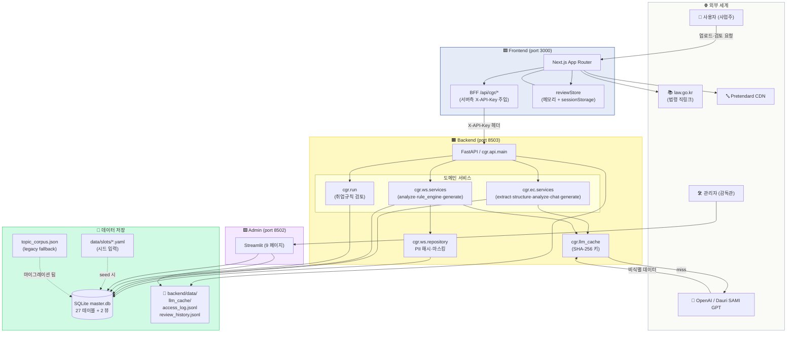
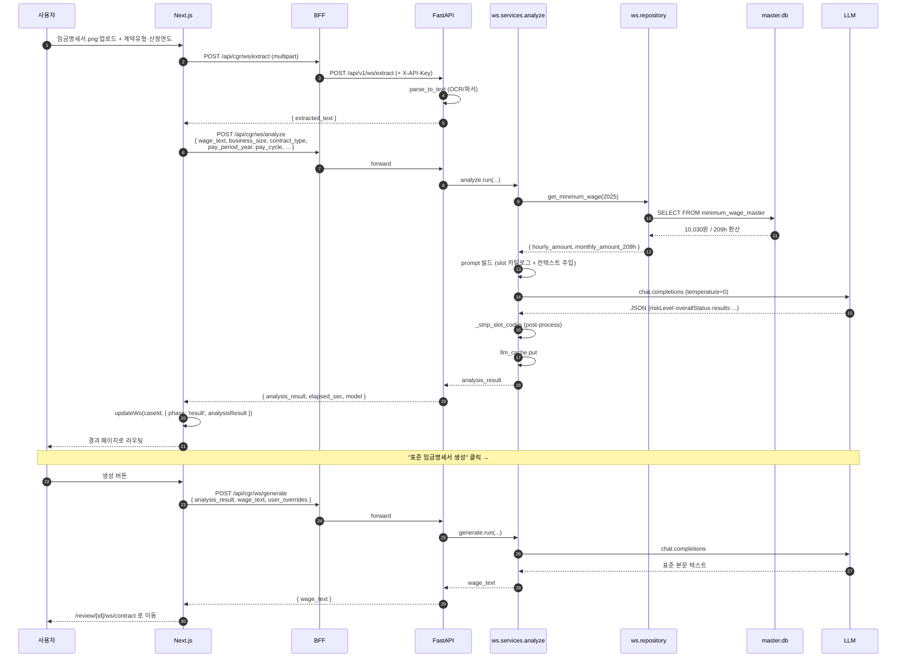
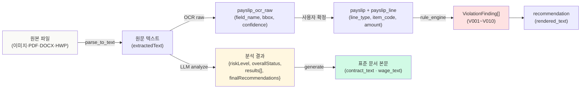
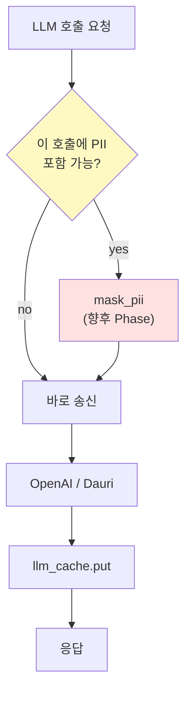

# 03 · 데이터 흐름도

시스템 컴포넌트 간 데이터 이동을 시각화. **무엇이 어디로 흘러가는가** 를 한눈에.

---

## 1. 전체 흐름도 (시스템 레벨)



---

## 2. 검토 요청 — 데이터 흐름 (Request 시퀀스)

### 임금명세서 검토 예시



---

## 3. 데이터 단위 — 무엇이 흐르는가



---

## 4. 영속화 흐름 (DB 기록 단위)

| 사용자 액션 | 기록되는 행 |
|---|---|
| 사업장 등록 | `workplace` (1 행, business_no SHA-256 hash) |
| 근로자 등록 | `employee` (1 행, emp_no hash + name 마스킹) |
| 임금명세서 업로드 | `payslip_document` (1 행, doc_uid 부여) |
| OCR 추출 | `payslip_ocr_raw` (N 행 — field 단위) |
| 사용자 확정 | `payslip` (1 행) + `payslip_line` (N 행) |
| 룰엔진 실행 | `inspection_run` (1 행, ruleset_version 박힘) |
| 위반 탐지 | `violation_finding` (N 행 — 룰당 1개) |
| 권고 생성 | `recommendation` (N 행, rendered_text) |
| 사용자 수정 | `correction_log` (N 행) |
| LLM 비계산적 판단 | `llm_judgment` (N 행 — 통상임금 분류 등) |
| 검토 결과 (취업규칙·근로계약서) | `audit_case` + `audit_finding` |
| 모든 LLM 호출 | `backend/data/llm_cache/` (SHA-256 키 → JSON) |
| 모든 사용자 방문 | `backend/data/access_log.jsonl` |

---

## 5. 외부 LLM 호출 — 비식별 게이트



**현재**: 사업장·근로자 식별자는 DB 저장 시 해시. 본문 텍스트는 그대로 LLM 송신 (베타 한정).
**계획**: 본문에서 이름·주민번호·연락처를 추출 마스킹 후 LLM 호출.

---

## 6. 캐시·로그 위치

```
backend/data/
├── master.db                 # SQLite — 모든 영구 데이터
├── llm_cache/                # LLM 응답 캐시 (sha256.json)
├── access_log.jsonl          # 사용자 방문·액션
├── review_history.jsonl      # 취업규칙 검토 누적
├── admin_settings.json       # 관리자 임계값·모델 설정
├── topic_corpus.json         # legacy — 시드 입력
├── topic_index.json          # legacy — 임베딩 인덱스
├── slots/                    # 시드 입력 YAML
│   ├── atomic_slots_ec.yaml
│   ├── atomic_slots_v0.yaml  (취업규칙)
│   └── atomic_slots_wage.yaml
└── prompts/                  # 프롬프트 사용자화 (관리자에서 편집)
```

---

## 7. 도커·배포 시 데이터 경로 (참고)

운영 시 환경변수로 override 가능:

| 환경변수 | 기본 | 용도 |
|---|---|---|
| `CGR_MASTER_DB` | `backend/data/master.db` | SQLite 파일 경로 |
| `API_KEY` | secrets.toml | 일반 API 키 |
| `ADMIN_API_KEY` | secrets.toml | 관리자 API 키 |
| `ADMIN_PASSWORD` | secrets.toml | Streamlit 로그인 |
| `NEXT_PUBLIC_API_BASE` | `http://localhost:8503` | 프론트→백엔드 |
| `CGR_API_KEY` | (서버측만) | BFF→백엔드 |
