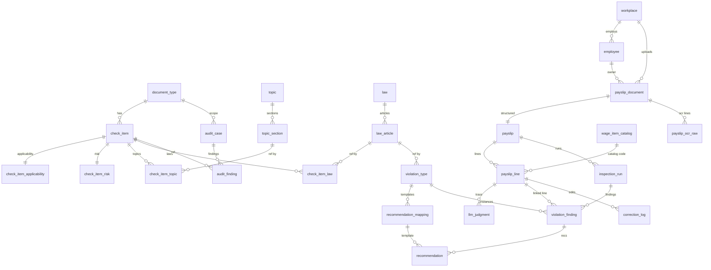

# 04 · 자료사전 (Data Dictionary)

SQLite 마스터 DB (`backend/data/master.db`) 의 전체 테이블·컬럼·관계·제약.
38 테이블 + 4 뷰. 현재 행 수는 시드 직후 기준 (2026-05).

> **Phase 17 (노무제공자 모듈)** — `document_type` 4종으로 확장 (`service_provider_contract` 추가),
> `check_item` 161 → 177 (+SC 16 슬롯), 신규 법령 6개·신규 주제 5개 등록.

소스: [`backend/cgr/db/schema.sql`](../backend/cgr/db/schema.sql)

---

## 📚 도메인 구조

```
🟦 정규화 마스터 (Phase 1~3)     5 테이블 · ~1879 행
🟦 슬롯 카탈로그 (Phase 1~5)     5 테이블 · 629 행
🟧 계산형 룰 마스터 (Phase 6)    4 테이블 · 44 행
🟪 트랜잭션 (Phase 7-Back)       7 테이블 · 가변 (사용에 따라)
🟩 검토 결과·이력                6 테이블 · 가변
🟫 꿀팁 가이드 (Phase 16)        11 테이블 · 283 행 ·  v_guide_for_employer 뷰

총 38 테이블 + 4 뷰
```

> **자율점검 원칙 (Phase 16)** — 분쟁·진정·구제 신청 관련 데이터(서식 5건 `FRM020~FRM024`, 기관 8건
> `ORG004/005/015~019/021`)는 Excel 시드 단계에서 **완전 제외**되었습니다. 추가로 `excluded_from_service`
> 컬럼(`guide_item`·`obligation_timeline`·`form_template`·`gov_org`)으로 방어적 필터를 이중화합니다.

---

## 🟦 정규화 마스터

### `document_type` — 문서 종류

| 컬럼 | 타입 | 제약 | 설명 |
|---|---|---|---|
| `id` | INTEGER | PK AUTOINCREMENT | |
| `code` | TEXT | UNIQUE NOT NULL | `employment_contract` / `work_rules` / `wage_statement` |
| `name` | TEXT | NOT NULL | `근로계약서` / `취업규칙` / `임금명세서` |
| `bucket_count` | INTEGER | NOT NULL | 5-bucket 분류 수 (EC=3, WR=5, WS=3) |
| `created_at` | TEXT | DEFAULT now | |

**현재**: 3 행

---

### `topic` — 노무사회 주제 (31)

| 컬럼 | 타입 | 제약 | 설명 |
|---|---|---|---|
| `id` | INTEGER | PK | |
| `code` | TEXT | UNIQUE NOT NULL | 예: `DB_근로시간`, `DB_가산수당` |
| `name` | TEXT | NOT NULL | 예: `근로시간`, `가산수당` |
| `description` | TEXT | | |
| `source` | TEXT | | `노무사회 250825` |
| `created_at` | TEXT | DEFAULT now | |

**현재**: 31 행. 소스: obsidian `02_주제_노하우/*.md`.

---

### `topic_section` — 주제 섹션 (1,779)

| 컬럼 | 타입 | 제약 | 설명 |
|---|---|---|---|
| `id` | INTEGER | PK | |
| `topic_id` | INTEGER | FK → topic.id ON DELETE CASCADE | |
| `section_no` | TEXT | NOT NULL | `2.1.1` 등 계층 번호 |
| `title` | TEXT | | 짧은 제목 |
| `body_original` | TEXT | | 노무사회 원문 (마크다운) |
| `body_friendly` | TEXT | | LLM paraphrase 한 일반인 톤 |
| `law_refs` | TEXT | | JSON 배열 `["근로기준법 제50조"]` |
| `case_refs` | TEXT | | JSON 배열 (판례) |
| UNIQUE | | (topic_id, section_no) | |

**INDEX**: `idx_topic_section_topic` ON `topic_id`
**현재**: 1,779 행. 시드: `data/topic_corpus.json`.

---

### `law` — 법령 (10)

| 컬럼 | 타입 | 제약 | 설명 |
|---|---|---|---|
| `id` | INTEGER | PK | |
| `code` | TEXT | UNIQUE NOT NULL | `근로기준법`, `근로기준법시행령`, `최저임금법` 등 |
| `full_name` | TEXT | | |
| `external_base` | TEXT | | `https://www.law.go.kr/법령/근로기준법` |

**현재**: 10 (근로기준법·시행령·최저임금법·근로자퇴직급여보장법·기간제및단시간근로자보호등에관한법률·국민건강보험법·국민연금법·고용보험법·산업재해보상보험법·외국인근로자의고용등에관한법률)

---

### `law_article` — 법령 조문 (56)

| 컬럼 | 타입 | 제약 | 설명 |
|---|---|---|---|
| `id` | INTEGER | PK | |
| `law_id` | INTEGER | FK → law.id ON DELETE CASCADE | |
| `article_no` | TEXT | NOT NULL | `제17조`, `제27조의2` |
| `paragraph_no` | TEXT | | `제1항` |
| `item_no` | TEXT | | `제1호` |
| `title` | TEXT | | `근로조건의 명시` 등 |
| `body` | TEXT | | 본문 발췌 |
| `penalty` | TEXT | | `500만원 이하 벌금` 등 |
| `external_url` | TEXT | | law.go.kr 직링크 |
| UNIQUE | | (law_id, article_no, paragraph_no, item_no) | |

**INDEX**: `idx_law_article_law`
**현재**: 56 행.

---

## 🟦 슬롯 카탈로그

### `check_item` — 슬롯 (161)

| 컬럼 | 타입 | 제약 | 설명 |
|---|---|---|---|
| `id` | INTEGER | PK | |
| `document_type_id` | INTEGER | FK → document_type.id ON DELETE CASCADE | |
| `code` | TEXT | NOT NULL | `SLOT_EC_01_사용자_정보` 등 |
| `name` | TEXT | NOT NULL | 사용자에게 보이는 항목명 |
| `required_content` | TEXT | | 기재되어야 할 내용 |
| `purpose` | TEXT | | 기재 필요 이유 |
| `category` | TEXT | | EC: `공통`/`5인이상`/`기간제`... WS: `null` |
| `comparator` | TEXT | DEFAULT `presence` | `presence`/`numeric_gte`/... |
| `display_order` | INTEGER | DEFAULT 0 | UI 정렬 |
| UNIQUE | | (document_type_id, code) | |

**INDEX**: `idx_check_item_doc`
**현재**: EC 35 + WR 115 + WS 11 = 161 행.

---

### `check_item_applicability` — 적용 조건 (161)

| 컬럼 | 타입 | 제약 | 설명 |
|---|---|---|---|
| `id` | INTEGER | PK | |
| `check_item_id` | INTEGER | FK → check_item.id | |
| `business_size` | TEXT | | `5+` / `5-` / `any` |
| `worker_types` | TEXT | | JSON 배열 `["정규직","기간제"]` 또는 `["any"]` |
| `written_duty` | TEXT | | `필수_서면교부` 등 |

---

### `check_item_risk` — 위험도 (161)

| 컬럼 | 타입 | 제약 | 설명 |
|---|---|---|---|
| `check_item_id` | INTEGER | PK FK → check_item.id | |
| `missing_severity` | TEXT | | 미기재 시 — `CRITICAL/HIGH/MEDIUM/LOW` |
| `violation_severity` | TEXT | | 기재 부적절 시 |
| `fix_example` | TEXT | | 시정 예시 |

---

### `check_item_topic` — 슬롯 ↔ 주제 매핑 (89)

| 컬럼 | 타입 | 제약 |
|---|---|---|
| `check_item_id` | INTEGER | NOT NULL FK |
| `topic_section_id` | INTEGER | NOT NULL FK |
| `weight` | REAL | DEFAULT 1.0 |
| PRIMARY KEY | | (check_item_id, topic_section_id) |

**현재**: 89 행 (33-매핑 70 + WS YAML 19).

---

### `check_item_law` — 슬롯 ↔ 법령 조문 매핑 (57)

| 컬럼 | 타입 | 제약 |
|---|---|---|
| `check_item_id` | INTEGER | FK |
| `law_article_id` | INTEGER | FK |
| PRIMARY KEY | | (check_item_id, law_article_id) |

**현재**: 57 행 (33-매핑 41 + WS YAML 16).

---

## 🟧 계산형 룰 마스터 (Phase 6)

### `minimum_wage_master` — 연도별 최저임금 (5)

| 컬럼 | 타입 | 제약 | 설명 |
|---|---|---|---|
| `year` | INTEGER | PK | |
| `hourly_amount` | INTEGER | NOT NULL | 시간급 (원) |
| `monthly_amount_209h` | INTEGER | NOT NULL | 월 환산 (주40h × 4.345주 ≈ 209h) |
| `effective_from` | TEXT | NOT NULL | YYYY-MM-DD |
| `effective_to` | TEXT | | 미래 연도는 NULL |
| `source` | TEXT | | `최저임금위원회 고시 제2024-1호` 등 |
| `notice_url` | TEXT | | |

**현재**: 2022(9,160) / 2023(9,620) / 2024(9,860) / 2025(10,030) / 2026(10,320)

---

### `wage_item_catalog` — 임금항목 카탈로그 (19)

| 컬럼 | 타입 | 제약 | 설명 |
|---|---|---|---|
| `item_code` | TEXT | PK | `BASIC`, `OT`, `NIGHT`, `HOLIDAY`, `MEAL` 등 |
| `item_name` | TEXT | NOT NULL | 한글 표기 — `기본급`, `연장근로수당` |
| `item_category` | TEXT | NOT NULL | `기본급` / `법정수당` / `약정수당` / `실비변상` / `상여` / `공제` |
| `line_type` | TEXT | DEFAULT `PAYMENT` | `PAYMENT` / `DEDUCTION` |
| `is_ordinary_wage` | INTEGER | DEFAULT 0 | 통상임금 포함 여부 (기본값, LLM override 가능) |
| `is_average_wage` | INTEGER | DEFAULT 0 | 평균임금 포함 여부 |
| `is_taxable` | INTEGER | DEFAULT 1 | |
| `legal_basis` | TEXT | | `근로기준법 제56조` 등 |
| `description` | TEXT | | |
| `aliases` | TEXT | | JSON 배열 — 사업장별 이형 표기 (`["중식보조비","식비"]`) |

**INDEX**: `idx_wage_item_category`
**현재**: PAYMENT 11 + DEDUCTION 8 = 19 행

---

### `violation_type` — 위반유형 카탈로그 (10)

| 컬럼 | 타입 | 제약 | 설명 |
|---|---|---|---|
| `violation_code` | TEXT | PK | `V001`~`V010` |
| `violation_name` | TEXT | NOT NULL | `임금명세서 필수기재 누락` 등 |
| `severity` | TEXT | NOT NULL | `HIGH` / `MID` / `LOW` |
| `judgment_kind` | TEXT | DEFAULT `rule` | `rule` (계산형) / `llm` (판단형) |
| `legal_article` | TEXT | | 자유 텍스트 `근로기준법 제48조 제2항` |
| `law_article_id` | INTEGER | FK → law_article.id | seed 시 자동 매칭 |
| `description` | TEXT | | |
| `penalty` | TEXT | | `500만원 이하 과태료` 등 |

**INDEX**: `idx_violation_severity`
**현재**: V001~V010 (HIGH 8 / MID 2 · rule 9 / llm 1)

---

### `recommendation_mapping` — 권고안 매핑 (10)

| 컬럼 | 타입 | 제약 |
|---|---|---|
| `recommendation_id` | INTEGER | PK |
| `violation_code` | TEXT | NOT NULL FK → violation_type.violation_code |
| `condition_expr` | TEXT | 적용 조건 (`business_size='5-'` 등) |
| `recommendation_text` | TEXT | NOT NULL · `{변수}` 자리표시자 가능 |
| `template_fix` | TEXT | 자동 수정 템플릿 |
| `priority` | INTEGER | DEFAULT 100 — 낮을수록 우선 |

**INDEX**: `idx_recommendation_violation`
**현재**: V001~V010 각각 1 행 = 10

---

## 🟪 트랜잭션 도메인 (Phase 7-Back)

### `workplace` — 사업장 (PII 해시)

| 컬럼 | 타입 | 제약 | 설명 |
|---|---|---|---|
| `id` | INTEGER | PK | |
| `business_no_hashed` | TEXT | UNIQUE | 사업자번호 SHA-256 |
| `workplace_name` | TEXT | | |
| `industry_code` | TEXT | | KSIC 코드 |
| `employee_count` | INTEGER | | 상시 근로자 수 |
| `weekly_work_hours_std` | REAL | DEFAULT 40.0 | 표준 주 소정근로시간 |
| `pay_cycle_type` | TEXT | DEFAULT `monthly` | `monthly/weekly/hourly/daily` |
| `created_at` | TEXT | DEFAULT now | |

**INDEX**: `idx_workplace_bizno`

---

### `employee` — 근로자 (PII 마스킹)

| 컬럼 | 타입 | 제약 | 설명 |
|---|---|---|---|
| `id` | INTEGER | PK | |
| `workplace_id` | INTEGER | NOT NULL FK | |
| `emp_no_hashed` | TEXT | | SHA-256 |
| `name_masked` | TEXT | | `홍○○` 마스킹 |
| `hire_date` | TEXT | | |
| `contract_type` | TEXT | DEFAULT `정규직` | |
| `job_position` | TEXT | | |
| `hourly_wage_agreed` | INTEGER | | |
| `monthly_wage_agreed` | INTEGER | | |
| `weekly_contract_hours` | REAL | | |
| UNIQUE | | (workplace_id, emp_no_hashed) | |

**INDEX**: `idx_employee_workplace`

---

### `payslip_document` — 임금명세서 업로드 단위

| 컬럼 | 타입 | 제약 | 설명 |
|---|---|---|---|
| `id` | INTEGER | PK | |
| `doc_uid` | TEXT | UNIQUE NOT NULL | 외부 노출 식별자 (`DOC_xxx`) |
| `workplace_id` | INTEGER | FK | |
| `employee_id` | INTEGER | FK | |
| `pay_period_year` | INTEGER | | |
| `pay_period_month` | INTEGER | | |
| `pay_period_start` | TEXT | | |
| `pay_period_end` | TEXT | | |
| `payment_date` | TEXT | | |
| `original_file_path` | TEXT | | |
| `ocr_status` | TEXT | DEFAULT `PENDING` | `PENDING/DONE/FAILED` |
| `ocr_confidence_avg` | REAL | | |
| `uploaded_at` | TEXT | DEFAULT now | |
| `uploaded_by` | TEXT | | |

**INDEX**: `idx_payslip_doc_uid`, `idx_payslip_doc_workplace`

---

### `payslip_ocr_raw` — OCR 원문 (라인별)

| 컬럼 | 타입 | 제약 |
|---|---|---|
| `id` | INTEGER | PK |
| `document_id` | INTEGER | NOT NULL FK |
| `field_name` | TEXT | `기본급`, `소득세` 등 OCR 라벨 |
| `raw_text` | TEXT | OCR 원문 |
| `bbox_coords` | TEXT | JSON `{x,y,w,h}` |
| `confidence_score` | REAL | |

---

### `payslip` — 확정 임금명세서

사용자가 OCR 결과를 확인·수정한 후 확정. document 당 1 행.

| 컬럼 | 타입 | 비고 |
|---|---|---|
| `id` PK | INTEGER | |
| `document_id` UNIQUE FK | INTEGER | |
| `worker_name` | TEXT | 마스킹된 성명 |
| `worker_birth_or_emp_no` | TEXT | 마스킹 |
| `total_work_days` | REAL | 근로일수 |
| `total_work_hours` | REAL | 총 근로시간 (V002 분모) |
| `overtime_hours` | REAL | 연장근로시간 |
| `night_hours` | REAL | 야간근로시간 |
| `holiday_hours` | REAL | 휴일근로시간 |
| `payment_date` | TEXT | |
| `total_gross` | INTEGER | 임금 총액 |
| `total_deduction` | INTEGER | 공제 총액 |
| `total_net` | INTEGER | 실수령액 |
| `is_user_confirmed` | INTEGER | DEFAULT 0 |
| `confirmed_at` | TEXT | |

---

### `payslip_line` — 임금 라인 (1:N)

각 임금명세서의 지급·공제 라인. 항목수 가변이라 정규화.

| 컬럼 | 타입 | 비고 |
|---|---|---|
| `id` PK | INTEGER | |
| `payslip_id` FK | INTEGER | NOT NULL |
| `line_type` | TEXT | NOT NULL `PAYMENT/DEDUCTION` |
| `item_code` FK → wage_item_catalog | TEXT | 표준 코드 |
| `item_name_original` | TEXT | 사업장 표기 원문 (`중식보조비`) |
| `calculation_basis` | TEXT | `시급×시간×1.5` |
| `unit_amount` | INTEGER | 단가 |
| `quantity` | REAL | 수량 (시간 등) |
| `amount` | INTEGER | NOT NULL DEFAULT 0 |
| `is_ordinary_wage_final` | INTEGER | LLM 판단 반영 (`NULL`=catalog 기본값) |
| `llm_judgment_id` | INTEGER | 비계산적 판단 FK (deferred) |
| `display_order` | INTEGER | |

**INDEX**: `idx_payslip_line_slip`, `idx_payslip_line_type`

---

### `llm_judgment` — LLM 비계산적 판단 트레이스

| 컬럼 | 타입 | 비고 |
|---|---|---|
| `id` PK | INTEGER | |
| `payslip_line_id` FK | INTEGER | |
| `question_type` | TEXT | `ORDINARY_WAGE`, `AVERAGE_WAGE` 등 |
| `input_context` | TEXT | 비식별 프롬프트 JSON |
| `llm_model_version` | TEXT | |
| `llm_response_raw` | TEXT | |
| `judgment_result` | TEXT | `TRUE/FALSE/UNCERTAIN` |
| `user_override` | INTEGER | DEFAULT 0 — 사용자가 뒤집었는지 |
| `judged_at` | TEXT | DEFAULT now |

---

## 🟩 검토 실행 결과

### `inspection_run` — 룰셋 실행 단위 (계산형)

| 컬럼 | 타입 | 비고 |
|---|---|---|
| `id` PK | INTEGER | |
| `run_uid` UNIQUE | TEXT | 외부 식별자 `RUN_xxx` |
| `payslip_id` FK | INTEGER | NOT NULL |
| `ruleset_version` | TEXT | NOT NULL **시점 데이터** |
| `minimum_wage_year` | INTEGER | NOT NULL — 어느 연도 최저임금 적용 |
| `total_violations` | INTEGER | DEFAULT 0 |
| `overall_status` | TEXT | `OK/WARN/VIOLATION` |
| `executed_at` | TEXT | DEFAULT now |

**INDEX**: `idx_inspection_run_payslip`

---

### `violation_finding` — 위반 탐지 (룰 단위)

| 컬럼 | 타입 | 비고 |
|---|---|---|
| `id` PK | INTEGER | |
| `run_id` FK | INTEGER | NOT NULL |
| `violation_code` FK | TEXT | NOT NULL `V001`~`V010` |
| `payslip_line_id` FK | INTEGER | ON DELETE SET NULL |
| `detected_value` | TEXT | `시급 9,500원` |
| `expected_value` | TEXT | `최저시급 10,030원` |
| `difference_amount` | INTEGER | 차액 (원) |
| `detail_description` | TEXT | |
| `status` | TEXT | DEFAULT `OPEN` — `OPEN/FIXED/IGNORED` |

**INDEX**: `idx_violation_finding_run`, `idx_violation_finding_code`

---

### `recommendation` — 사용자 제시 권고

| 컬럼 | 타입 | 비고 |
|---|---|---|
| `id` PK | INTEGER | |
| `finding_id` FK | INTEGER | NOT NULL |
| `recommendation_template_id` FK → recommendation_mapping | INTEGER | |
| `rendered_text` | TEXT | NOT NULL — 변수 치환된 최종 본문 |
| `suggested_amount` | INTEGER | |
| `is_accepted` | INTEGER | DEFAULT 0 |
| `accepted_at` | TEXT | |

**INDEX**: `idx_recommendation_finding`

---

### `correction_log` — 사용자 수정 이력

| 컬럼 | 타입 | 비고 |
|---|---|---|
| `id` PK | INTEGER | |
| `payslip_line_id` FK | INTEGER | ON DELETE SET NULL |
| `field_name` | TEXT | |
| `before_value` | TEXT | |
| `after_value` | TEXT | |
| `correction_reason` | TEXT | `USER_EDIT/OCR_FIX/RECOMMENDATION_ACCEPT` |
| `corrected_by` | TEXT | |
| `corrected_at` | TEXT | DEFAULT now |

**INDEX**: `idx_correction_log_line`

---

### `audit_case` · `audit_finding` — 검토 사례·결과 (취업규칙/근로계약서 호환)

기존 흐름 (Phase 1~4) 용. 임금명세서 신규 흐름은 `inspection_run`/`violation_finding` 사용.

| audit_case 컬럼 | 타입 | 비고 |
|---|---|---|
| `id` PK | INTEGER | |
| `case_uid` UNIQUE | TEXT | |
| `document_type_id` FK | INTEGER | |
| `filename` | TEXT | |
| `business_size` | TEXT | |
| `worker_types` | TEXT | JSON |
| `overall_status` | TEXT | `위험/보완필요/적정` |
| `risk_level` | TEXT | `상/중/하` |
| `elapsed_sec` | REAL | |
| `created_at` | TEXT | DEFAULT now |

| audit_finding 컬럼 | 타입 | 비고 |
|---|---|---|
| `id` PK | INTEGER | |
| `case_id` FK | INTEGER | NOT NULL |
| `check_item_id` FK | INTEGER | |
| `bucket` | TEXT | `적절/보완필요/부적절` (또는 5-bucket) |
| `found_text` | TEXT | 본문에서 추출된 표현 |
| `reason` | TEXT | 판단 이유 |
| `recommendation` | TEXT | LLM 권고 |
| `user_override` | TEXT | SuggestBlock 사용자 표현 |
| `applied_at` | TEXT | 사용자가 '문서에 반영' 한 시각 |

---

## 🟫 꿀팁 가이드 도메인 (Phase 16)

영세사업주 자율점검 보조 가이드 — Excel `영세사업주를 위한 꿀팁.xlsx` (15 시트) 를 11 테이블로 정규화.
자율점검 본질을 지키기 위해 분쟁·진정·구제 신청 관련 행은 **시드 단계에서 완전 제외** 됨.

### `guide_item` — 가이드 항목 (26)

| 컬럼 | 타입 | 제약 | 설명 |
|---|---|---|---|
| `id` | INTEGER | PK | |
| `code` | TEXT | UNIQUE NOT NULL | `GU001`~ |
| `audience` | TEXT | NOT NULL | `worker` / `employer` / `both` |
| `category` | TEXT | | 예: `근로시간`, `임금` |
| `title` | TEXT | NOT NULL | 항목 제목 |
| `worker_reason` | TEXT | | 근로자 입장 |
| `employer_reason` | TEXT | | 사업주 입장 |
| `key_points` | TEXT | | 핵심 포인트 (개행 구분) |
| `related_laws` | TEXT | | 관련 법령 |
| `priority` | TEXT | | `상` / `중` / `하` |
| `applies_under_5` | TEXT | | 5인 미만 적용 여부 |
| `note` | TEXT | | |
| `excluded_from_service` | INTEGER | DEFAULT 0 | 방어 필터 |

**INDEX**: `audience`, `category` · **현재**: 26 행.

---

### `obligation_timeline` — 시기별 의무 (28)

사업개시 → 채용 → 근로 중 → 종료 단계별 의무 매핑.

| 컬럼 | 타입 | 제약 | 설명 |
|---|---|---|---|
| `code` | TEXT | UNIQUE NOT NULL | `OBL001`~ |
| `stage` | TEXT | NOT NULL | `사업개시`/`채용`/`근로 중`/`종료` |
| `duty` | TEXT | NOT NULL | 의무 명 |
| `description` | TEXT | | |
| `deadline` | TEXT | | 기한 |
| `legal_basis` | TEXT | | 근거 법령 |
| `priority` | TEXT | | `상`/`중`/`하` |
| `penalty` | TEXT | | 위반 시 제재 |
| `excluded_from_service` | INTEGER | DEFAULT 0 | 방어 필터 |

**INDEX**: `stage` · **현재**: 28 행.

---

### `wage_calc_formula` — 임금 계산 공식 (15)

연장·야간·휴일·주휴수당 등의 공식 + 룰엔진 V001~V010 cross-link.

| 컬럼 | 타입 | 제약 | 설명 |
|---|---|---|---|
| `code` | TEXT | UNIQUE NOT NULL | `WCF001`~ |
| `category` | TEXT | | 예: `연장근로` |
| `calc_name` | TEXT | NOT NULL | `연장근로수당` |
| `formula` | TEXT | NOT NULL | `통상시급 × 연장시간 × 1.5` |
| `conditions` | TEXT | | 적용 조건 |
| `limits` | TEXT | | 한도 |
| `legal_basis` | TEXT | | 근거 법령 |
| `note` | TEXT | | |
| `related_violation_code` | TEXT | FK → `violation_type(violation_code)` | V001~V010 |

**FK 매핑** — `V003 연장근로수당 미지급` ↔ `WCF` 의 `연장근로수당` 공식 등 4건.
프론트 가이드 페이지에서 위반 항목 클릭 시 가이드 공식으로 직링크.

**현재**: 15 행.

---

### `guide_glossary` — 용어 사전 (14)

통상임금·평균임금·최저임금 등 혼동 용어 정리.

| 컬럼 | 타입 | 제약 | 설명 |
|---|---|---|---|
| `code` | TEXT | UNIQUE NOT NULL | `GLO001`~ |
| `term` | TEXT | UNIQUE NOT NULL | 용어 |
| `short_def` | TEXT | | 한 줄 정의 |
| `full_def` | TEXT | | 상세 정의 |
| `confusable_with` | TEXT | | 혼동 가능 용어 |
| `legal_basis` | TEXT | | |

**현재**: 14 행.

---

### `form_template` — 표준 서식 (16)

근로계약서·임금명세서·취업규칙 등 표준 서식 메타데이터. **download_url** 은 고용노동부 자료실 외부 링크
(Phase 18 에서 채움).

| 컬럼 | 타입 | 제약 | 설명 |
|---|---|---|---|
| `code` | TEXT | UNIQUE NOT NULL | `FRM001`~ |
| `category` | TEXT | | |
| `form_name` | TEXT | NOT NULL | |
| `purpose` | TEXT | | |
| `submitter` | TEXT | | |
| `submit_to` | TEXT | | |
| `submit_method` | TEXT | | |
| `deadline` | TEXT | | |
| `legal_basis` | TEXT | | |
| `download_url` | TEXT | | 외부 URL (호스팅 X) |
| `audience` | TEXT | DEFAULT `employer` | |
| `excluded_from_service` | INTEGER | DEFAULT 0 | |

**INDEX**: `audience` · **현재**: 16 행 (분쟁용 `FRM020~FRM024` 5건 제외 후).

---

### `gov_org` — 정부 기관·온라인 채널 (14)

자율점검 안내용 기관 정보. **노동위원회·검찰 등 분쟁 기관 8건 제외** 후 14건 시드.

| 컬럼 | 타입 | 제약 | 설명 |
|---|---|---|---|
| `code` | TEXT | UNIQUE NOT NULL | `ORG001`~ |
| `org_class` | TEXT | | 분류 |
| `org_name` | TEXT | NOT NULL | |
| `duties` | TEXT | | 담당 업무 |
| `common_cases` | TEXT | | 흔한 활용 사례 |
| `phone` | TEXT | | |
| `online_channel` | TEXT | | URL |
| `jurisdiction` | TEXT | | |
| `note` | TEXT | | |
| `audience` | TEXT | DEFAULT `employer` | |
| `excluded_from_service` | INTEGER | DEFAULT 0 | |

**시드 제외**: `ORG004, ORG005, ORG015~019, ORG021`. **현재**: 14 행.

---

### `audit_guide` — 감사 종류·절차 (11)

근로감독 사전 점검에 쓰는 가이드.

| 컬럼 | 타입 | 제약 | 설명 |
|---|---|---|---|
| `code` | TEXT | UNIQUE NOT NULL | `AUD001`~ |
| `kind` | TEXT | NOT NULL | `type` (종류) / `procedure` (절차) |
| `name` | TEXT | NOT NULL | |
| `step_no` | INTEGER | | procedure 의 단계 번호 |
| `timing` | TEXT | | |
| `description` | TEXT | | |
| `period_covered` | TEXT | | type 의 대상 기간 |
| `legal_basis` | TEXT | | |

**현재**: 11 행.

---

### `required_document` — 비치·보존 서류 (42)

근로기준법상 작성·비치·보존 의무 서류 카탈로그.

| 컬럼 | 타입 | 제약 | 설명 |
|---|---|---|---|
| `code` | TEXT | UNIQUE NOT NULL | `RDC001`~ |
| `classification` | TEXT | | 분류 |
| `doc_name` | TEXT | NOT NULL | |
| `description` | TEXT | | |
| `prep_time` | TEXT | | 작성 시기 |
| `retention_period` | TEXT | | 보존 기간 |
| `legal_basis` | TEXT | | |
| `penalty` | TEXT | | 위반 시 제재 |

**현재**: 42 행.

---

### `recruit_compliance` — 채용 컴플라이언스 (20)

공고 → 면접 → 채용 결정 단계의 차별 금지, 정보 수집 제한 등.

| 컬럼 | 타입 | 제약 | 설명 |
|---|---|---|---|
| `code` | TEXT | UNIQUE NOT NULL | `REC001`~ |
| `stage` | TEXT | NOT NULL | |
| `duty` | TEXT | NOT NULL | |
| `description` | TEXT | | |
| `violation_examples` | TEXT | | |
| `penalty` | TEXT | | |
| `applies_to` | TEXT | | 적용 대상 |
| `legal_basis` | TEXT | | |
| `checkpoint` | TEXT | | 점검 포인트 |

**현재**: 20 행.

---

### `size_threshold_duty` — 사업장 규모별 의무 (32)

`1인 이상`, `5인 이상`, `10인 이상`, `30인 이상`, `50인 이상` — 각 규모별 의무. API
`/api/v1/guide/by-size/{min_size}` 는 **SIZE_RANK 누적**으로 본인 규모 이하 모두 반환.

| 컬럼 | 타입 | 제약 | 설명 |
|---|---|---|---|
| `code` | TEXT | UNIQUE NOT NULL | `SIZ001`~ |
| `min_size` | TEXT | NOT NULL | `1인 이상`/`5인 이상`/... |
| `duty` | TEXT | NOT NULL | |
| `description` | TEXT | | |
| `related_docs` | TEXT | | |
| `legal_basis` | TEXT | | |
| `note` | TEXT | | |

**INDEX**: `min_size` · **현재**: 32 행.

---

### `employment_lifecycle` — 고용 생애주기 (38)

채용 → 근로 중 → 종료 → 사후 단계의 요구사항.

| 컬럼 | 타입 | 제약 | 설명 |
|---|---|---|---|
| `code` | TEXT | UNIQUE NOT NULL | `LIF001`~ |
| `phase` | TEXT | NOT NULL | |
| `sub_topic` | TEXT | | |
| `requirement` | TEXT | | |
| `related_docs` | TEXT | | |
| `timing` | TEXT | | |
| `legal_basis` | TEXT | | |
| `note` | TEXT | | |

**현재**: 38 행.

---

## 👓 편의 뷰

### `v_check_item_full`

한 슬롯의 풀 컨텍스트 — 적용조건·위험도·연관 주제 섹션·법령 조문을 JSON 배열로.

```sql
SELECT slot_code, item_name, missing_severity, topic_refs_json, law_refs_json
FROM v_check_item_full
WHERE document_type = 'wage_statement';
```

### `v_inspection_full`

한 검토 실행 (`inspection_run`) 의 풀 컨텍스트 — payslip + workplace + employee + findings JSON.

```sql
SELECT run_uid, workplace_name, employee_name, overall_status, findings_json
FROM v_inspection_full
ORDER BY executed_at DESC;
```

### `v_minimum_wage_current`

현재 적용 중인 최저임금 1 행 (`date('now')` 기준 자동).

```sql
SELECT year, hourly_amount FROM v_minimum_wage_current;
-- 2026, 10320
```

### `v_guide_for_employer`

사업주에게 노출 가능한 가이드 행만 모은 UNION 뷰 (`audience IN ('employer','both')` AND
`excluded_from_service = 0`). 통합 검색용.

```sql
SELECT source, code, name, category FROM v_guide_for_employer LIMIT 5;
-- guide_item       GU001  근로계약서 서면 작성·교부  사업개시
-- obligation_timeline  OBL001  ...
```

행 수: 84 — `/guide` 페이지 검색 가능 최대 항목 수와 같음.

---

## 🔗 관계도 (FK 의존성)



---

## 🧮 행 수 집계 (시드 직후)

| 도메인 | 테이블 | 행 수 |
|---|---|---:|
| 정규화 | document_type | 3 |
|  | topic | 31 |
|  | topic_section | 1,779 |
|  | law | 10 |
|  | law_article | 56 |
| 슬롯 | check_item | 161 |
|  | check_item_applicability | 161 |
|  | check_item_risk | 161 |
|  | check_item_topic | 89 |
|  | check_item_law | 57 |
| 룰 | minimum_wage_master | 5 |
|  | wage_item_catalog | 19 |
|  | violation_type | 10 |
|  | recommendation_mapping | 10 |
| 트랜잭션·검토 | (사용에 따라 가변) | — |
| 꿀팁 가이드 | guide_item | 26 |
|  | obligation_timeline | 28 |
|  | wage_calc_formula | 15 |
|  | guide_glossary | 14 |
|  | form_template | 16 |
|  | gov_org | 14 |
|  | audit_guide | 11 |
|  | required_document | 42 |
|  | recruit_compliance | 20 |
|  | size_threshold_duty | 32 |
|  | employment_lifecycle | 38 |

**합계 시드 직후**: ~2,835 행 (감사·트랜잭션 가변 데이터 별도)
가이드 도메인 단독: 283 행, 시드 단계 분쟁 데이터 13건 (서식 5 + 기관 8) 사전 제외.
