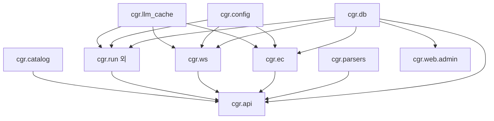

# 05 · 모듈 가이드 (`cgr.*` 패키지)

Python 백엔드(`backend/cgr/`) 의 구조·책임·의존성.

> **`cgr` 의 의미**: 초기 "취업규칙(Chwieobgyuchik) Review" 의 약자.
> 현재는 3 문서 검토 + 마스터 DB 통합 패키지. 운영 안정성 위해 패키지명 유지.

---

## 디렉토리 트리

```
backend/cgr/
├── __init__.py
├── __main__.py
│
├── 🔵 [공용 인프라]
├── config.py            # 환경변수·LLM 모델·API 키 로딩
├── llm_cache.py         # LLM 응답 캐시 (SHA-256 키)
├── db/                  # SQLite 마스터 DB
│   ├── __init__.py      # connect() 컨텍스트 매니저
│   └── schema.sql       # 27 테이블 + 3 뷰 DDL
│
├── 🟦 [정규화 마스터·임베딩]
├── catalog.py           # 슬롯 카탈로그 로딩 (yaml + master DB)
├── master_db.py         # Excel-기반 취업규칙 마스터 DB (legacy)
├── topic_db.py          # 주제 코퍼스 (legacy fallback)
├── embedding.py         # 임베딩 생성·매칭
├── embed_matcher.py     # 임베딩 기반 검색
├── applicability.py     # 슬롯 적용조건 필터
├── legal_links.py       # 법령 정보 매핑
├── law_category.py      # 법령 카테고리
├── penalty_parser.py    # 벌칙 텍스트 파싱
├── article_prefilter.py # 조항 사전 필터
├── optional_display.py  # 선택적 표시 (legacy)
├── optional_display_emb.py # 동(임베딩 버전)
│
├── 🟦 [취업규칙 검토 (work rules)]
├── extractor.py         # LLM 추출
├── explainer.py         # LLM 설명
├── verdict.py           # 판정 로직
├── rules.py             # 룰
├── reporter.py          # 리포트 생성
├── run.py               # 메인 실행 함수
├── models.py            # Pydantic 모델
│
├── 🟧 [근로계약서 (employment_contract)]
├── ec/
│   ├── __init__.py
│   ├── catalog.py       # EC 슬롯 카탈로그 (SQL 우선, YAML fallback)
│   ├── prompts.py       # extract·structure·analyze·chat 시스템 프롬프트
│   ├── topic_lookup.py  # 슬롯 → 주제 섹션 lookup
│   ├── verdict.py       # 판정 룰
│   ├── run.py
│   └── services/        # 단계별 서비스 (LLM 호출 캡슐화)
│       ├── analyze.py   # 33-매핑 위반 분석
│       ├── chat.py      # 결과 후속 챗봇
│       ├── generate.py  # 표준 계약서 생성
│       └── structure.py # 8섹션 구조화
│
├── 🟧 [임금명세서 (wage_statement) — Phase 5~7]
├── ws/
│   ├── __init__.py
│   ├── catalog.py       # 11 슬롯 카탈로그 (DB 전용)
│   ├── models.py        # Pydantic — Workplace·Employee·Payslip·InspectionResult 등
│   ├── repository.py    # SHA-256 hash·마스킹·upsert·save_inspection_run
│   └── services/
│       ├── analyze.py   # LLM 분석 (11 슬롯 + 최저임금 주입)
│       ├── generate.py  # 표준 임금명세서 생성
│       └── rule_engine.py # 계산형 룰 V001/V002/V010
│
├── 🟪 [파서 — OCR·문서]
├── parsers/             # PNG/JPG (Vision OCR), DOCX, HWP, PDF, TXT
│
├── 🟩 [API — FastAPI]
├── api/
│   ├── __init__.py
│   ├── main.py          # FastAPI 앱·CORS·라우터 등록
│   ├── auth.py          # X-API-Key 검증
│   ├── schemas.py       # 공통 입출력 스키마
│   └── routes/
│       ├── review.py    # POST /api/v1/review — 취업규칙
│       ├── ec.py        # /api/v1/ec/* — 4단계 + chat
│       ├── ws.py        # /api/v1/ws/* — analyze/inspect/generate/catalog
│       ├── topics.py    # GET /api/v1/topics/corpus
│       ├── slots.py     # 슬롯 카탈로그
│       ├── master_db.py # 마스터 DB read-only
│       ├── history.py   # 검토 이력
│       └── admin.py     # 관리자 설정·캐시
│
├── 🟨 [Streamlit UI]
├── web/
│   ├── streamlit_app.py # 검토 앱 (port 8501) — legacy
│   ├── admin/           # 관리자 앱 (port 8502)
│   │   ├── admin_app.py # 홈 (파이프라인 플로우)
│   │   ├── auth.py
│   │   ├── theme.py     # civic 디자인 토큰 inject
│   │   ├── ui_common.py # 공통 컴포넌트
│   │   ├── data_relation/ # 데이터 관계도 탭들
│   │   ├── pages/       # 9 페이지 (파이프라인 순서)
│   │   └── store/       # 파일 IO 헬퍼 (history, prompts, slot_writer, access_log)
│   └── review_app/      # 사용자 검토 앱 (legacy — Next.js 로 이관)
│
└── ui/                  # legacy — 사용 안 함
```

---

## 패키지별 책임

### `cgr.db` — 마스터 DB

**책임**: SQLite 단일 진입점.
- `connect()` — 컨텍스트 매니저 (자동 commit/rollback, sqlite3.Row factory, FK 강제)
- `init_schema(drop_first)` — 스키마 생성·재생성
- `table_counts()` — 디버그용
- `get_db_path()` — `CGR_MASTER_DB` 환경변수 override

**의존**: 표준 라이브러리만.
**사용처**: 모든 모듈 (catalog/services/admin).

---

### `cgr.ec` — 근로계약서 모듈

**책임**: 33-매핑 기반 4단계 검토 + 챗봇.

```
ec/
├── catalog.py       # SQL 우선 + YAML fallback. EcCatalog/EcSlot Pydantic.
├── prompts.py       # 시스템 프롬프트 (extract·structure·analyze·chat·generate)
├── topic_lookup.py  # SQL 우선 + JSON fallback. 항목 → 노무사회 섹션.
├── verdict.py       # 검토 결과 룰 기반 후처리
├── run.py           # 통합 실행 함수
└── services/
    ├── structure.py # OCR 텍스트 → 8섹션 JSON
    ├── analyze.py   # 33매핑 위반 분석 + 결정성 캐시
    ├── chat.py      # 결과 후속 챗봇
    └── generate.py  # 표준 계약서 생성
```

**의존**: `cgr.db`, `cgr.llm_cache`, `cgr.config`.

---

### `cgr.ws` — 임금명세서 모듈 (Phase 5~7)

**책임**: 11 슬롯 LLM 분석 + 계산형 룰엔진 + 표준 명세서 생성.

```
ws/
├── catalog.py    # 마스터 DB 전용 로더 (YAML fallback 없음 — Phase 1~3 통합 후 SQL only)
├── models.py     # Pydantic — Workplace/Employee/Payslip/PayslipLine/
│                 #         ViolationFinding/InspectionResult
├── repository.py # 영속화 — hash_pii·mask_name·upsert·save_inspection_run
└── services/
    ├── analyze.py     # LLM 11 슬롯 분석. 컨텍스트에 최저임금 자동 주입.
    ├── rule_engine.py # V001 (필수기재) / V002 (최저임금) / V010 (공제분리)
    └── generate.py    # 시정안 반영된 표준 명세서 본문
```

**의존**: `cgr.db`, `cgr.llm_cache`, `cgr.config`.
**테이블 사용**: `check_item` (slot), `minimum_wage_master`, `wage_item_catalog`, `violation_type`, `recommendation_mapping`, `workplace`/`employee`/`payslip`/`payslip_line`, `inspection_run`/`violation_finding`/`recommendation`, `correction_log`.

---

### `cgr.api` — FastAPI 진입점

**책임**: HTTP API. 외부 호출은 모두 여기 통과.

```
api/
├── main.py    # 앱·CORS·8 라우터 등록
├── auth.py    # X-API-Key + Admin Key 분리
├── schemas.py # 공통 응답 스키마
└── routes/
    ├── review.py     # 취업규칙 (legacy 통합 흐름)
    ├── ec.py         # 근로계약서 5 엔드포인트
    ├── ws.py         # 임금명세서 4 엔드포인트
    ├── topics.py     # 코퍼스 (Phase 4)
    ├── slots.py      # 슬롯 CRUD
    ├── master_db.py  # 98조 read-only
    ├── history.py    # 검토 이력
    └── admin.py      # 시스템 설정·캐시
```

**의존**: 모든 도메인 모듈 + `cgr.db`.

---

### `cgr.web.admin` — Streamlit 관리자

**책임**: 운영자용 데이터 탐색·편집 UI.

```
web/admin/
├── admin_app.py     # 홈 — 파이프라인 9 단계 플로우 대시보드
├── auth.py          # admin_password 검증·잠금
├── theme.py         # civic 디자인 토큰 inject (Pretendard·네이비·라운드카드)
├── ui_common.py     # 공통 헬퍼 (page_header·kpi_card·render_diff)
├── pages/           # 사이드바 9 페이지 (파이프라인 순서)
│   ├── 01_📚_마스터DB.py    # 27테이블 + 풀컨텍스트 + 룰 + 검토이력
│   ├── 02_📋_슬롯편집.py
│   ├── 03_📝_프롬프트편집.py
│   ├── 04_📊_검토이력.py
│   ├── 05_🗂_데이터관계.py
│   ├── 06_⚖️_모델비교.py
│   ├── 07_💾_캐시관리.py
│   ├── 08_⚙️_시스템설정.py
│   └── 09_📈_방문통계.py
├── store/           # 파일 기반 IO (read-only or atomic write)
│   ├── access_log.py
│   ├── history.py
│   ├── prompt_writer.py
│   └── slot_writer.py
└── data_relation/   # 06 페이지의 탭별 본문 (graph, distribution, frequency 등)
```

**의존**: `cgr.db`, `cgr.config`, `cgr.llm_cache`, `cgr.catalog`.

---

### `cgr.parsers` — 파서 디스패처

**책임**: 파일 종류별 파서 라우팅.

| 확장자 | 처리 |
|---|---|
| `.png` / `.jpg` 등 | Vision OCR (LLM) |
| `.docx` | python-docx |
| `.hwp` | HWP 파서 |
| `.pdf` | PDF parser |
| `.txt` | 평문 |

**진입점**: `parsers.dispatcher.parse_to_text(path)`.

---

### `cgr.config`

`get_api_key()` / `get_llm_model()` / `get_embed_model()`.
환경변수 → `.streamlit/secrets.toml` → 기본값 순.

---

### `cgr.llm_cache`

```python
key = llm_cache.make_key(system=..., user=..., schema={...}, model=...)
cached = llm_cache.get(key)
llm_cache.put(key, value)
```

저장: `backend/data/llm_cache/{sha256}.json`. Stats: `entries`, `size_kb`.

---

## 의존성 그래프



---

## 자주 쓰는 진입점

| 작업 | 코드 |
|---|---|
| DB 연결 | `from cgr import db; with db.connect() as conn: ...` |
| 슬롯 카탈로그 (EC) | `from cgr.ec.catalog import load_ec_catalog; cat = load_ec_catalog()` |
| 슬롯 카탈로그 (WS) | `from cgr.ws.catalog import load_ws_catalog` |
| 룰엔진 실행 | `from cgr.ws.services.rule_engine import inspect; result = inspect(payslip)` |
| LLM 호출 (캐싱) | `cgr/ec/services/analyze.py` 패턴 참고 |
| API 라우트 등록 | `cgr.api.main` 의 `include_router` |

---

## 신규 문서 도메인 추가 시 체크리스트

새로운 검토 대상 문서 (예: 도급계약서) 추가 시:
1. `cgr/db/schema.sql` → `document_type` 행 추가
2. `data/slots/atomic_slots_xxx.yaml` 슬롯 카탈로그 작성
3. `cgr/scripts/seed_master_db.py` 에 시드 함수 추가
4. `cgr/xxx/catalog.py` + `cgr/xxx/services/{analyze,generate}.py`
5. `cgr/api/routes/xxx.py` + `main.py` 라우터 등록
6. `frontend/src/app/review/[id]/xxx/page.tsx` + CSS
7. `frontend/src/lib/api/xxx.ts` 클라이언트
8. `docs/04_자료사전.md` · `02_데이터_파이프라인.md` 갱신
